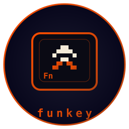

# funkey



**A game engine for the terminal. Written in Rust.** The games, with pictures: [isene.org/funkey](https://isene.org/funkey/)

   

A game draws pixels into a frame and reads keys. funkey runs the loop at a fixed rate and shows the frame in the terminal. That is half blocks, or real pixels where the terminal has the kitty graphics protocol. Every cell holds two pixels in full colour, so a 160 by 50 terminal is a 160 by 100 pixel screen. Only the cells that changed are sent. Where a terminal can show real pixels, a later backend will. Part of the [Fe₂O₃ Rust terminal suite](https://github.com/isene/fe2o3).

The first game on it is `climb`, a Jumpman-style platformer:

```bash
cargo run --release --example climb
```

Arrows or WASD move, Space jumps, Up and Down climb a ladder, R restarts, Q quits.

## What the engine gives a game

- **Frame**: a pixel framebuffer with rectangles, lines, circles, sprites, two built-in fonts at any scale, and a dim for overlays.
- **Sprite**: rows of characters and a palette, or a PNG file cut into a sheet. Flipping, scaling, tinting.
- **Input**: keys with a held state. Where the terminal reports releases (glass, kitty), a key is held from press to release. `pressed` for the tick a key went down, `axis_x` and `axis_y` for movement.
- **Tilemap and Body**: levels as lines of text, solid and one-way tiles, drawn with a camera. Boxes fall, run and stop at walls.
- **Audio**: samples mixed in the engine and piped to pw-play, paplay or aplay. WAV files, Doom lumps, or made on the spot: tones, slides, noise, and tunes written as notes. Channels that loop, change volume and pitch while they play.
- **Particles**: bursts of sparks that fly, fall and fade.
- **Raster**: a software 3D rasterizer. Meshes of flat-shaded triangles, a camera, a depth buffer, fog.
- **wad and doom**: Doom's WAD files, and the sector renderer that draws a level and the sprites a game hands it.
- **Rng and store**: seeded random numbers, and high scores kept under `~/.funkey/`.
- **run**: a fixed-step loop at the frame rate you ask for. The frame is scaled to the terminal and centred. With `FUNKEY_SCRIPT` set, the same loop runs with no terminal and writes frames, for tests and films.

A game is a type with two methods:

```rust
use funkey::*;

struct Ball { x: f32, y: f32, vx: f32, vy: f32 }

impl Game for Ball {
    fn update(&mut self, input: &Input, dt: f32) -> Flow {
        if input.pressed(Key::Char('q')) { return Flow::Quit; }
        self.x += self.vx * dt;
        self.y += self.vy * dt;
        if self.x < 0.0 || self.x > 156.0 { self.vx = -self.vx; }
        if self.y < 0.0 || self.y > 96.0 { self.vy = -self.vy; }
        Flow::Continue
    }
    fn draw(&mut self, f: &mut Frame) {
        f.clear(0x102030);
        f.rect(self.x as i32, self.y as i32, 4, 4, 0xffcc00);
    }
}

fn main() {
    run(&mut Ball { x: 10.0, y: 10.0, vx: 60.0, vy: 40.0 }, Config { width: 160, height: 100, fps: 60 });
}
```

## The games

Four games come with the engine, and Doom below:

- `climb`: a small Jumpman-style platformer, 200 lines. Ladders, coins, blobs.
- `jumpman`: a Jumpman Junior kind of game. Five levels of girders, ladders and ropes. Bombs to collect, bullets to jump, robots to dodge. A fall from too high is the end of you. Some bombs reveal ladders or take girders away. A title tune, a high score.
- `invaders`: fifty-five of them, marching down. Shields crumble where they are hit. The march quickens as the rows thin, a mystery ship crosses the top, each wave starts lower.
- `drive`: a car on a winding road over the hills, on the 3D rasterizer. Fetch the packages before the clock runs out, then more of them with less time. An arrow points at the nearest. Go fast, leave the road, regret it.

```bash
cargo run --release --example jumpman
cargo run --release --example invaders
cargo run --release --example drive
```

## Doom

The second game is Doom itself, on funkey's sector renderer: the level
drawn along its own BSP tree, front to back, monsters as sprites against
a depth buffer, light from the sector and the distance. A frame of
Freedoom's first map takes about a millisecond at 320 by 240.

```bash
cargo run --release --example doom            # ~/.funkey/freedoom1.wad, its first map
cargo run --release --example doom -- ~/.funkey/freedoom2.wad MAP03
cargo run --release --example doom -- --skill 4 --no-sound
```

What is in:
- every monster from Doom and Doom II, with Doom's own frame timings,
- their sight, chase, melee and ranged attacks, pain, death and gibs,
- the pain elemental's souls, the revenant's homing rockets, the mancubus spread, the arch-vile's fire,
- all nine weapons with their flashes, ammo and auto-aim; the BFG's spray; the berserk fist,
- health, armour, keys, backpacks, the messages,
- the powers: invulnerability, invisibility, the suit, the map, the visor,
- doors and locked doors, lifts, floors, ceilings, crushers, stairs,
- teleports, switches and their textures, exits and secret exits,
- light effects, animated flats and walls, damage floors, secrets,
- the status bar with the face, the automap, palette flashes,
- the intermission with kills, items, secrets and time, and the next map,
- sound effects from the WAD, mixed and piped to pw-play, paplay or aplay. No music.

Arrows turn and walk, W and S too, A and D sidestep, Space fires, E or
Enter uses, 1 to 7 pick a weapon, Tab shows the map (- and = zoom), Escape
quits. The old cheats work: iddqd, idkfa, idfa, idclip, idclev, idbehold,
iddt. Freedoom is free: [freedoom.github.io](https://freedoom.github.io/),
drop the WADs in `~/.funkey/`. Doom's own WADs load the same way.

For a test without a terminal, `DOOM_SCRIPT="up*70,space*30"` runs those
keys for that many tics and prints where things stand; `DOOM_SHOT=out.ppm`
writes the last frame. `DOOM_BENCH=1` times the renderer.

## Where it is going

- Heretic and Hexen: their WADs load, their monsters and weapons do not yet exist.
- Textured triangles and a mesh loader for the rasterizer.
- Music for Doom from its MUS lumps.

## Versions

The crate version is the engine's and moves only when the engine
changes. Each game has its own version, shown on its title screen and
tagged as `<game>-vX.Y`: `doom-v1.0`, `jumpman-v1.1`, `invaders-v1.0`,
`drive-v1.0`, `climb-v1.0`.

## Using it

```toml
[dependencies]
funkey = { version = "0.1", package = "fe2o3-funkey" }
```

Set `FUNKEY_PIXELS=kitty` to draw real pixels through the kitty graphics protocol instead of half blocks, in a terminal that has it. Set `FUNKEY_SHOT=/tmp/shot.ppm` to have the engine write the frame to a file twice a second, for screenshots and tests. `FUNKEY_SOUND=0` keeps it quiet.

`FUNKEY_SCRIPT="right*60,space,-*30"` runs a game with no terminal, feeding those keys for that many ticks, and writes the last frame to `FUNKEY_SHOT`. With `FUNKEY_SHOT_EVERY=1` every frame is written; ffmpeg makes a film of them.

## License

Public domain (Unlicense).
