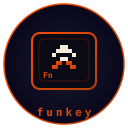

# funkey



**A game engine for the terminal. Written in Rust.** The games, with pictures: [isene.org/funkey](https://isene.org/funkey/)

   

A game draws pixels into a frame and reads keys. funkey runs the loop at a fixed rate and shows the frame in the terminal. That is half blocks, or real pixels where the terminal has the kitty graphics protocol. Every cell holds two pixels in full colour, so a 160 by 50 terminal is a 160 by 100 pixel screen. Only the cells that changed are sent. Where a terminal can show real pixels, a later backend will. Part of the [Fe₂O₃ Rust terminal suite](https://github.com/isene/fe2o3).

The first game on it is `climb`, a Jumpman-style platformer:

```bash
cargo run --release --example climb
```

Arrows or WASD move, Space jumps, Up and Down climb a ladder, R restarts, Q quits.

## What the engine gives a game

- **Frame**: a pixel framebuffer with rectangles, lines, circles, sprites, two built-in fonts at any scale, and a dim for overlays. `fancy_text` writes a title in two colours with a shadow and a gleam that sweeps across. `mix` and `tint` blend and brighten colours.
- **Sprite**: rows of characters and a palette, or a PNG file cut into a sheet. Flipping, scaling, tinting. `scale2x` doubles pixel art without the stair steps, `shaded` lights it from the top left, `outlined` draws a line around it.
- **Input**: keys with a held state. Where the terminal reports releases (glass, kitty), a key is held from press to release. `pressed` for the tick a key went down, `axis_x` and `axis_y` for movement.
- **Tilemap and Body**: levels as lines of text, solid and one-way tiles, drawn with a camera. Boxes fall, run and stop at walls.
- **Audio**: samples mixed in the engine and piped to pw-play, paplay or aplay. WAV files, Doom lumps, or made on the spot: tones, slides, noise, and tunes written as notes. Channels that loop, change volume and pitch while they play. `Sample::synth` makes a sound from a formula, and `mixed` lays a tune over its bass.
- **Particles**: bursts of sparks that fly, fall and fade.
- **noise**: the same value for the same place every time. Smooth noise that wraps, layers of it for hills and clouds, ridges for mountains.
- **Raster**: a software 3D rasterizer. Meshes of flat-shaded triangles, a camera, a depth buffer, fog.
- `Scene`: textured triangles with a light per corner, `Texture`s that wrap, have holes and shrink into mip levels, `Model` builders for boxes, tubes and cones, sphere culling, fog, a sky through every pixel, and the rows painted on every core at once.
- **wad and doom**: Doom's WAD files, and the sector renderer that draws a level and the sprites a game hands it.
- **Rng and store**: seeded random numbers, and values kept under `~/.funkey/`.
- **scores**: a top ten with initials, as on an arcade cabinet. A game says `scores::record(GAME, score)` when it is over. A score that makes the list has the engine ask for three initials and then show the list. The list is a file under `~/.funkey/`.
- **run**: a fixed-step loop at the frame rate you ask for. The frame is scaled to the terminal and centred. With `FUNKEY_SCRIPT` set, the same loop runs with no terminal and writes frames, for tests and films. `bench` times a game the same way.
- **Pause**: a game returns `Flow::Pause` and the engine does the rest. The picture goes dark under the word PAUSED and the sound stops. The game then uses no processor time until a key is pressed. Switch to another window and the engine pauses by itself, where the terminal reports it (glass, kitty and most others).

A game is a type with two methods:

```rust
use funkey::*;

struct Ball { x: f32, y: f32, vx: f32, vy: f32 }

impl Game for Ball {
    fn update(&mut self, input: &Input, dt: f32) -> Flow {
        if input.pressed(Key::Char('q')) { return Flow::Quit; }
        self.x += self.vx * dt;
        self.y += self.vy * dt;
        if self.x < 0.0 || self.x > 156.0 { self.vx = -self.vx; }
        if self.y < 0.0 || self.y > 96.0 { self.vy = -self.vy; }
        Flow::Continue
    }
    fn draw(&mut self, f: &mut Frame) {
        f.clear(0x102030);
        f.rect(self.x as i32, self.y as i32, 4, 4, 0xffcc00);
    }
}

fn main() {
    run(&mut Ball { x: 10.0, y: 10.0, vx: 60.0, vy: 40.0 }, Config { width: 160, height: 100, fps: 60 });
}
```

## The games

Fifteen games come with the engine, and Doom below:

- `climb`: a small Jumpman-style platformer, 200 lines. Ladders, coins, blobs.
- `jumpman`: a Jumpman Junior kind of game. Five levels of girders, ladders and ropes. Bombs to collect, bullets to jump, robots to dodge. A fall from too high is the end of you. Some bombs reveal ladders or take girders away. A title tune, a high score.
- `invaders`: fifty-five of them, marching down. Shields crumble where they are hit. The march quickens as the rows thin, a mystery ship crosses the top, each wave starts lower.
- `soar`: a flight over fractal mountains, water and clouds, a height map ray-cast a column at a time. A demo of what real pixels can look like; nothing to win.
- `castle`: a walk from the hills to a castle and in through its gate, on the textured rasterizer. Stone, slate and wood as textures, the sun and its shadows baked into every corner, banners, torches, pines, mountains and clouds, painted on every core at 960 by 600. Stone and the moat stop the walker. Nothing to win.
- `gems`: a tribute to Crystal Castles. A bear walks five castles seen from the corner and takes every gem before the gem eaters do. Trees walk, a crystal ball rolls, bees swarm, and the witch comes in each castle's third wave. The hat makes you safe for a while. There is a warp.
- `salvo`: a tribute to Gradius. Seven stages with a boss each: a volcano, stone heads, crystals, living cells, the sun, a maze and the fortress. Capsules light the power-up bar one step at a time, and Z takes what is lit. Speed, missiles, the double shot, the laser, options that follow the ship, a shield. Then it all begins again, harder.
- `eliminator`: the maze beneath the royal castle of Amar, played by the rules of the [Amar RPG](https://d6gaming.org). Five levels up to the gate, and the Raven Demon guarding it. Every roll is shown: the O6, the totals, the sum. Stances, double attacks at -5, wounds, light, fear, and marks that raise your skills. New to Amar? `i` on the title shows the three tiers, the O6 and a blow in three pages. Play it in a browser at [d6gaming.org](https://d6gaming.org/The_Eliminator_game.html).
- `stack`: a tribute to Tetris. The seven pieces turn and kick off the walls as in modern Tetris. A bag of seven deals them, and the next five show. Hold one, drop soft or hard, clear four rows at once, spin a T into its slot, chain clears into combos. Korobeiniki plays, faster when the well fills. A top-ten game asks for three initials. Left alone on the title, it plays itself.
- `raid`: a gunship over fractal mountains, in the spirit of Comanche. Six missions, from a radar post at dawn to a fortress at night. A gun, rockets and guided missiles against trucks, tanks, flak, gunboats, missile sites and other gunships. The gunship follows the ground at the height you set, and the hills are cover: a missile site cannot see what flies low behind one. Hover over the pad to rearm and repair.
- `vector`: a tribute to Tempest. Glowing lines on black: sixteen webs seen down their length, a claw on the rim, and what climbs the lanes toward it. Flippers flip from lane to lane, tankers split in two, spikers leave spikes, fuseballs ride the edges and pulsars charge their lane. A superzapper clears the web once. The lines add their light where they cross and fade as on a vector tube. Left alone, it plays itself.
- `marble`: a tribute to Marble Madness. A glass ball down six sloping courses that hang in the dark, against the clock. It rolls as a ball does: it gathers speed downhill, flies off a ramp and breaks after a long fall. Steel balls shove it, green springs eat it, acid melts it, and on ice the keys do little. Each loss costs time, and the seconds left at a goal go on to the next course. Left alone, it plays itself.
- `again`: a puzzle you solve with your own past. A life is a handful of steps in a small room. Then time starts over, and the self you just were walks beside you and presses the same keys. One of you stands on a plate while the next walks through the door it opens. Twenty rooms of plates, doors, and gates that let only a past self through, or only the present one. Take back a step, a life or the room. The round that plays gains a voice with every self.
- `kart`: in the spirit of Super Mario Kart. Eight karts on four tracks: a meadow, a beach, an icy pass and a desert. The road is flat and painted the way that game painted it, with the karts on it in 3D. Hop into a bend and hold the drift until the sparks turn blue or orange, then let go for a push. Boxes hand out six items, kinder ones to those at the back. A cup is four races of three laps, at 50, 100 or 150cc.
- `chomp`: in the spirit of Pac-Man, with a maze, art and sound of its own. A muncher eats the dots while four chasers hunt it by the arcade's rules. They scatter to their corners and chase by turns. One comes straight for you, one aims ahead, one closes in from the other side, and one loses heart up close. A power dot turns the hunt around for a few seconds. Each level is faster, and the scared seconds get fewer.
- `blocks`: in the spirit of Minecraft, the basics. A world of blocks grown from a seed: hills, tunnels through the stone and groves of trees. Walk it, dig into it and build on it with nine kinds of block. The corners where blocks meet are darker, and so is the ground under a roof. The world is kept when you leave. There is nothing to win.
- `drive`: a car on a winding road over the hills, on the 3D rasterizer. Fetch the packages before the clock runs out, then more of them with less time. An arrow points at the nearest. Go fast, leave the road, regret it.

```bash
cargo run --release --example jumpman
cargo run --release --example invaders
cargo run --release --example drive
cargo run --release --example soar
cargo run --release --example castle
cargo run --release --example gems
cargo run --release --example salvo
cargo run --release --example eliminator
cargo run --release --example stack
cargo run --release --example raid
cargo run --release --example vector
cargo run --release --example marble
cargo run --release --example again
cargo run --release --example kart
cargo run --release --example chomp
cargo run --release --example blocks
```

`funkeys` is the picker: the games as cards with screenshots, Enter plays
the one under the cursor, `?` shows its keys. In a terminal with kitty
graphics it gives the games real pixels. Every release on GitHub carries
`funkeys` and every game as binaries for Linux and macOS; the fe2o3
launcher fetches them all with `i` on its funkey card.

## In a web page

A game can run in a browser as well. Built for wasm32 without the
terminal, it says `funkey::web!(MyGame::new(), Config { .. })` where it
would call `run`, and `web/funkey.js` plays it in a canvas, with keys and
sound. `web/` builds eliminator that way:

```bash
cd web
cargo build --release --target wasm32-unknown-unknown --features eliminator
```

Play it at [d6gaming.org](https://d6gaming.org/The_Eliminator_game.html).

A game talks to its page through `funkey::page`: `send` a message out,
`recv` one back; in a terminal both do nothing. The top ten uses it: in a
page the list is one that everyone playing there shares, kept by
`server/scores.rb`, a small CGI script on isene.com.

## Doom

The second game is Doom itself, on funkey's sector renderer: the level
drawn along its own BSP tree, front to back, monsters as sprites against
a depth buffer, light from the sector and the distance. A frame of
Freedoom's first map takes about a millisecond at 320 by 240.

```bash
cargo run --release --example doom            # ~/.funkey/freedoom1.wad, its first map
cargo run --release --example doom -- ~/.funkey/freedoom2.wad MAP03
cargo run --release --example doom -- --skill 4 --no-sound
```

What is in:
- every monster from Doom and Doom II, with Doom's own frame timings,
- their sight, chase, melee and ranged attacks, pain, death and gibs,
- the pain elemental's souls, the revenant's homing rockets, the mancubus spread, the arch-vile's fire,
- all nine weapons with their flashes, ammo and auto-aim; the BFG's spray; the berserk fist,
- health, armour, keys, backpacks, the messages,
- the powers: invulnerability, invisibility, the suit, the map, the visor,
- doors and locked doors, lifts, floors, ceilings, crushers, stairs,
- teleports, switches and their textures, exits and secret exits,
- light effects, animated flats and walls, damage floors, secrets,
- the status bar with the face, the automap, palette flashes,
- the intermission with kills, items, secrets and time, and the next map,
- sound effects from the WAD, mixed and piped to pw-play, paplay or aplay. No music.

Arrows turn and walk, W and S too, A and D sidestep, Space fires, E or
Enter uses, 1 to 7 pick a weapon, Tab shows the map (- and = zoom), Escape
quits. The old cheats work: iddqd, idkfa, idfa, idclip, idclev, idbehold,
iddt. Freedoom is free: [freedoom.github.io](https://freedoom.github.io/),
drop the WADs in `~/.funkey/`. Doom's own WADs load the same way.

For a test without a terminal, `DOOM_SCRIPT="up*70,space*30"` runs those
keys for that many tics and prints where things stand; `DOOM_SHOT=out.ppm`
writes the last frame. `DOOM_BENCH=1` times the renderer.

## Where it is going

- Heretic and Hexen: their WADs load, their monsters and weapons do not yet exist.
- A mesh loader for the textured scene.
- Music for Doom from its MUS lumps.

## Versions

The crate version is the engine's and moves only when the engine
changes. Each game has its own version, shown on its title screen and
tagged as `<game>-vX.Y`: `doom-v1.0`, `jumpman-v1.1`, `invaders-v1.0`,
`drive-v1.0`, `soar-v1.1`, `climb-v1.0`, `castle-v1.1`, `gems-v1.3`, `salvo-v1.2`, `eliminator-v1.3`, `stack-v1.1`, `raid-v1.2`, `vector-v1.0`, `marble-v1.0`, `again-v1.0`, `kart-v1.2`, `chomp-v1.0`. `blocks` is new and has no tag yet. The picker is `funkeys-v1.12`.

## Using it

```toml
[dependencies]
funkey = { version = "0.1", package = "fe2o3-funkey" }
```

Set `FUNKEY_PIXELS=kitty` to draw real pixels through the kitty graphics protocol instead of half blocks, in a terminal that has it. Set `FUNKEY_SHOT=/tmp/shot.ppm` to have the engine write the frame to a file twice a second, for screenshots and tests. `FUNKEY_SOUND=0` keeps it quiet. `FUNKEY_SEED=7` gives the same random numbers on every run. `FUNKEY_KEYLOG=/tmp/keys.log` writes every key event the game receives, with its time, for a terminal where keys stick.

`FUNKEY_SCRIPT="right*60,space,-*30"` runs a game with no terminal, feeding those keys for that many ticks, and writes the last frame to `FUNKEY_SHOT`. With `FUNKEY_SHOT_EVERY=1` every frame is written; ffmpeg makes a film of them.

## License

Public domain (Unlicense).
